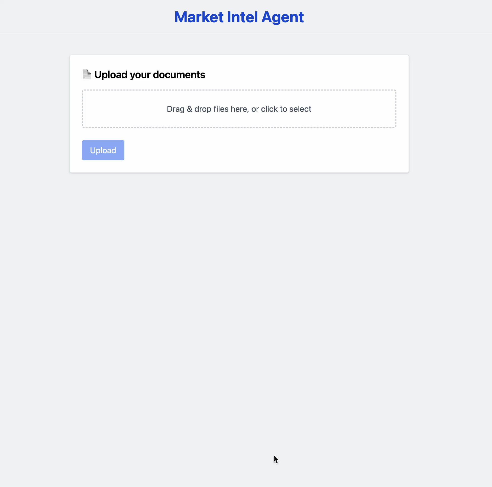
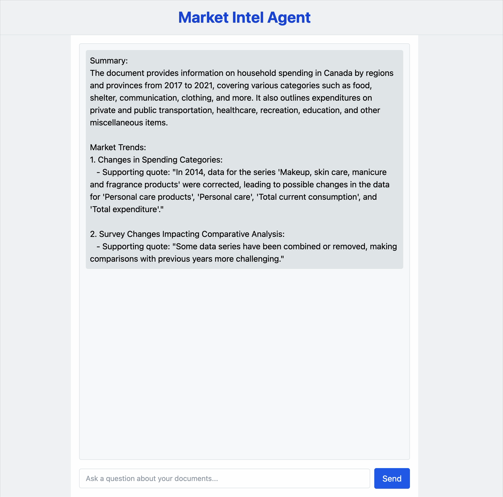
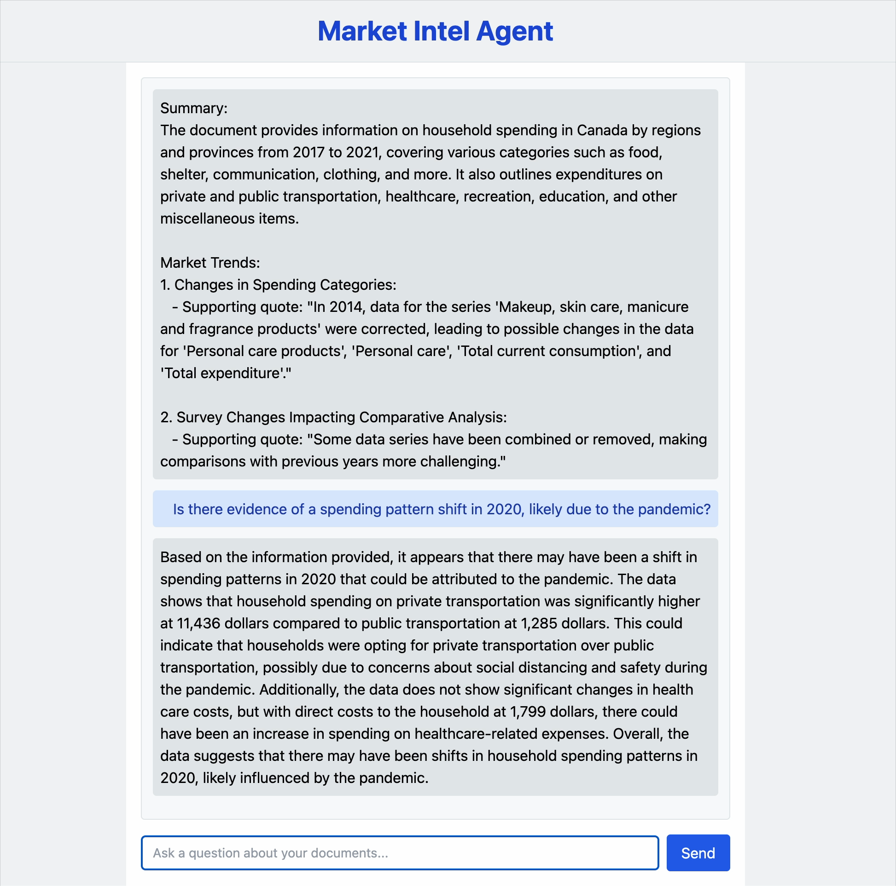
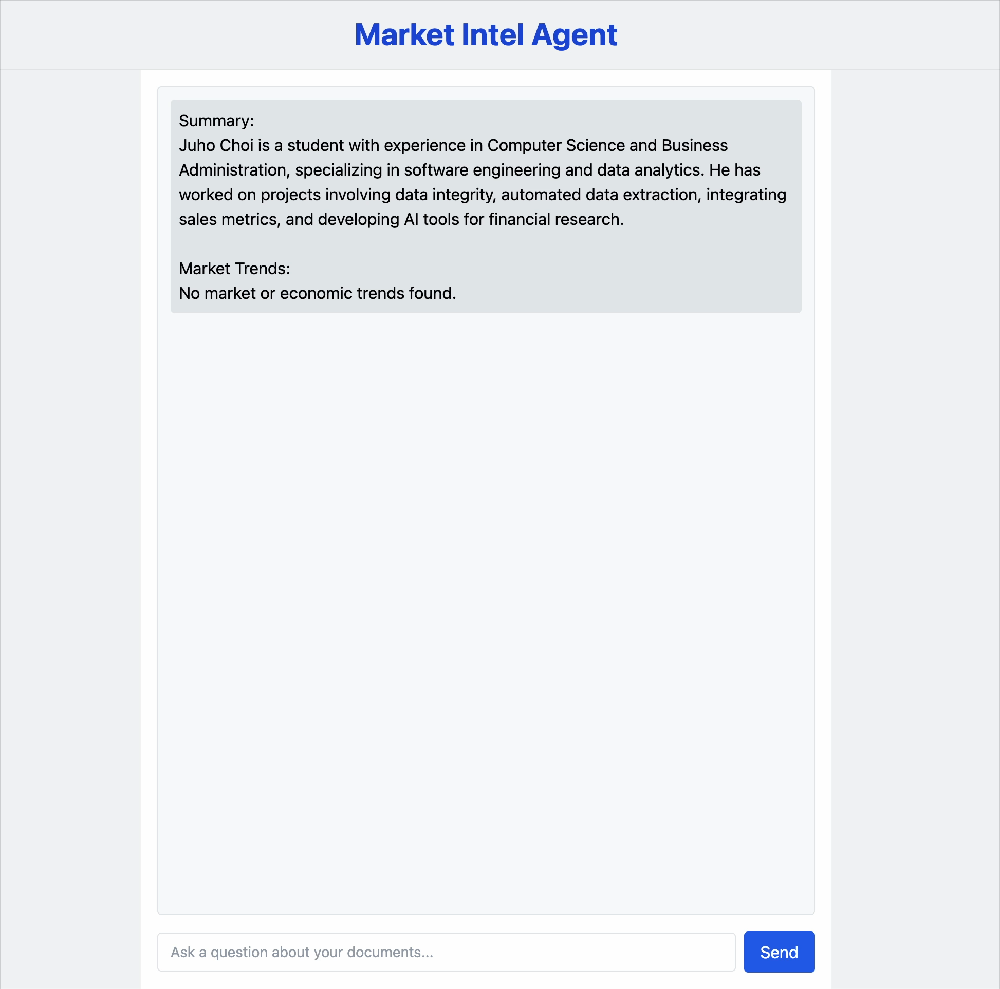

# Market Intel Agent


**Market Intel Agent** is a full-stack AI tool that allows users to upload multiple documents (PDF, CSV, TXT, PNG, JPG) and instantly extract summaries and insights using natural language.

It’s designed to streamline research workflows — especially in financial or strategic analysis — by enabling users to “chat with their documents” instead of reading them line-by-line.

---

## Screenshots

### 1. Landing Page – File Upload Interface



---

### 2. After Upload – Summary and Market Trend Analysis



---

### 3. Follow-up Question – Chat with Your Documents

!

---

### 4. No Market Trend Found – Fallback Handling



---

## Features

- Upload multiple files at once (PDF, CSV, TXT, PNG, JPG)
- AI-powered summarization and Q&A via OpenAI GPT-3.5
- Drag-and-drop interface (React + Tailwind)
- OCR support for image-based documents using Tesseract
- Local-first: only extracted text is sent to OpenAI (not full documents)
- Custom prompt generation for each query
- Chat interface to ask questions based on uploaded files

---

## Tech Stack

| Layer         | Tech Stack                                                       |
| ------------- | ---------------------------------------------------------------- |
| Frontend      | React + TypeScript + Tailwind CSS                                |
| Backend       | Go                                                               |
| AI API        | OpenAI GPT-3.5 via REST                                          |
| OCR / PDF     | Python (Tesseract OCR, pdf2image)                                |
| Communication | REST API (Go ⇄ Python ⇄ React)                                   |
| Optional      | Can integrate with Ollama or LLM Studio for full local inference |

---

## Project Structure

```
market-intel-agent/
├── client/             # React frontend (Vite + TS)
└── server/             # Go backend
    ├── handlers/       # Upload & chat handlers
    ├── utils/          # Prompt chunking & API calls
    └── scripts/        # OCR & PDF parsing (Python)
```

---

## Installation

```bash
# 1. Clone the project
git clone https://github.com/your-username/market-intel-agent.git
cd market-intel-agent

# 2. Start the backend
cd server
go run main.go

# 3. Start the frontend
cd ../client
npm install
npm run dev
```

> Python dependencies are in `server/scripts/requirements.txt`

---

## Challenges & Solutions

### Multi-format parsing

**Problem**: Handling PDFs, images, and spreadsheets consistently  
**Solution**: Centralized file router in Go, Python scripts for OCR/pdf2image

### Token limits (OpenAI)

**Problem**: Long files hit GPT’s token cap  
**Solution**: Implemented chunking and streaming summarization logic

### CORS issues in dev

**Problem**: Browser blocked frontend-backend requests  
**Solution**: Injected CORS headers manually in Go middleware

### OCR accuracy

**Problem**: Image-based PDFs weren’t extractable as text  
**Solution**: Converted PDFs to images and used pytesseract line-by-line

---

## What I Learned

- Structuring Go web servers and custom REST endpoints
- Calling OpenAI APIs with prompt engineering + chunking
- Managing a multi-language pipeline (Go + Python + React)
- Using OCR to extract text from visual documents
- Handling multi-file uploads, file storage, and context passing

---

## Security & Scalability

- Files are stored and processed locally
- Only extracted text is sent to OpenAI — not full documents
- **Future:** Can be made **100% local & secure** by connecting with **Ollama** or **LLM Studio**

---

## Limitations

- Relies on OpenAI API (currently not air-gapped)
- No user auth or saved session history (yet)
- Limited support for Excel/table-structured data
- Large documents can take time to chunk and summarize

---

## Future Improvements

- Full local LLM support via Ollama or LLM Studio
- Better structured data parsing (tables, Excel)
- Session storage and history
- Parallel processing for faster chunk summaries
- Dockerized deployment for internal distribution

---

## License

MIT License
